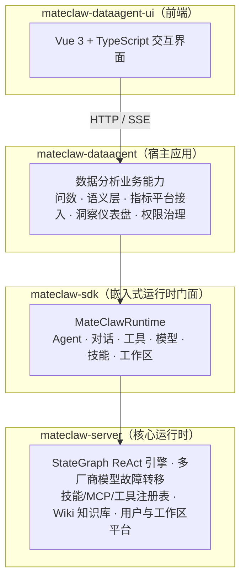
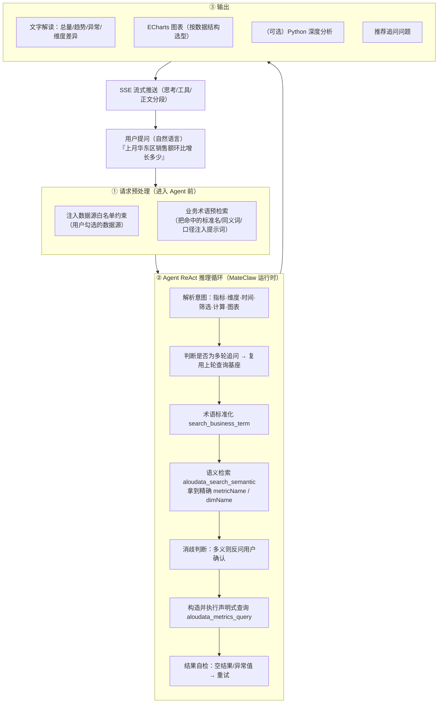
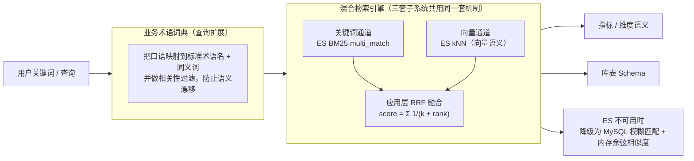
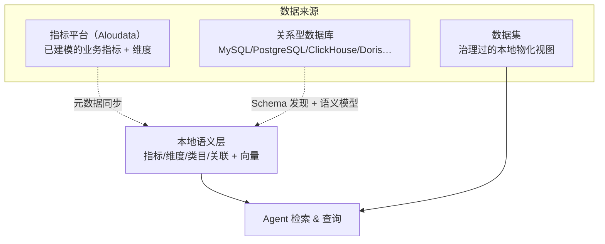
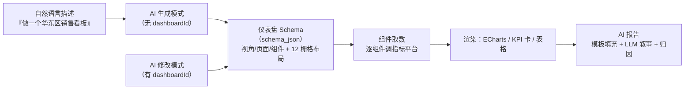
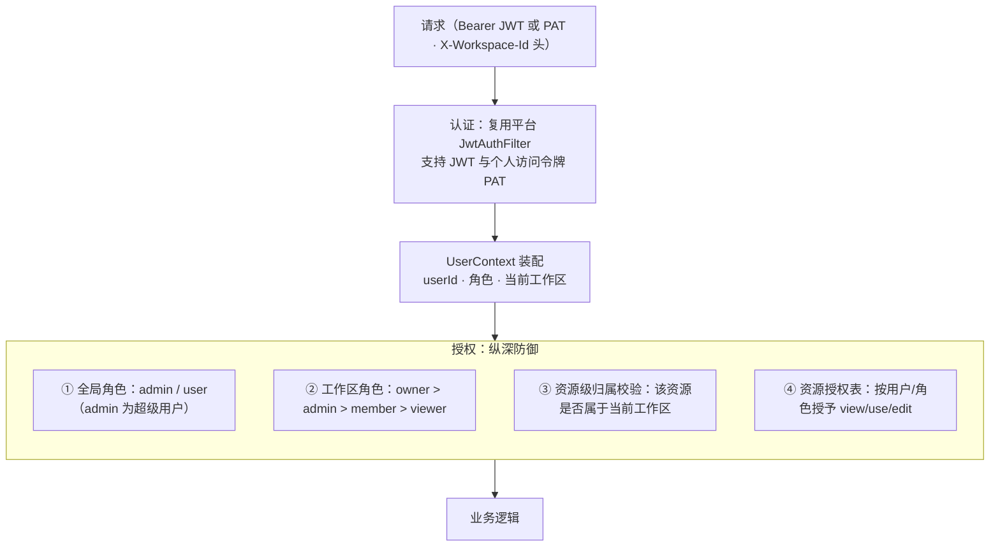
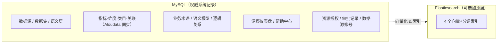

# MateClaw DataAgent — 项目介绍与架构说明

> 面向讲解与介绍的架构文档，兼顾**系统设计原理**与**可查阅的技术参考信息**（模块职责、技术栈、部署配置等）。

---

## 一、一句话定位

**MateClaw DataAgent 是一个面向业务人员的"智能问数"数据分析 Agent 工作台。**

它让不会写 SQL 的业务人员，用**自然语言**提出数据问题（"上个月华东区销售额同比增长多少？"），系统自动理解意图、找到正确的指标口径、执行查询、并以**文字结论 + 图表**的形式返回答案；需要时还能进一步做统计分析、机器学习和归因洞察，也能通过对话搭建可视化仪表盘。

它不是一个"聊天机器人套壳"，而是一整套围绕"让机器可靠地把自然语言翻译成精确数据查询"这一核心难题构建的工程系统。

---

## 二、它解决的核心问题

传统 BI 工具要求用户懂得数据结构、会拖拽字段、理解指标口径；而"把问题直接抛给一个大模型 + 一个 SQL 工具"的朴素做法，在企业真实数据环境下会频繁答错——因为：

1. **语义鸿沟**：用户说"营收"，数据平台里的标准指标名可能叫 `sales_amount`；用户说"最近"，系统不知道具体时间范围。业务口语和平台的精确定义之间没有天然映射。
2. **口径不统一**：同一个"活跃用户"，不同部门、不同 SQL 写法算出来的数字可能不一样。企业需要的是**统一治理过的指标**，而不是每次现算。
3. **强类型约束**：企业级指标平台是**声明式查询引擎**，参数有严格的语法和语义校验，不是自由 SQL，模型"猜"参数几乎必然出错。

DataAgent 的全部架构，都是为了系统性地跨越这道鸿沟。

---

## 三、与 MateClaw 的关系：宿主应用 + 运行时 SDK

DataAgent 并非从零构建的独立系统，而是构建在 **MateClaw Agent 运行时**之上的**宿主应用（Host Application）**，采用 Maven 多模块架构。



- **`mateclaw-server`**：MateClaw 的核心，提供 Agent 推理引擎、模型管理与多厂商故障转移、技能/工具注册、Wiki 知识库、用户与工作区平台等底座能力。
- **`mateclaw-sdk`**：把 server 的核心能力封装为一个编程式门面接口 `MateClawRuntime`。宿主应用只需注入这一个接口，即可调用 Agent 对话、工具注册、模型管理、技能、工作区等全部能力，**无需依赖 server 内部实现**。
- **`mateclaw-dataagent`**：本项目后端主体，专注实现"数据分析"这一垂直场景的业务能力，把通用的 Agent 底座留给 SDK。
- **`mateclaw-dataagent-ui`**：本项目前端工作台。

**这种分层的意义**：数据分析领域的复杂性（语义层、指标平台、仪表盘、权限）与通用 Agent 能力（推理、流式、多模型、技能）彻底解耦。底座升级不影响业务，业务迭代不碰底座。

### 模块构成

| 模块 | 职责 | 技术栈 |
|------|------|--------|
| **mateclaw-server** | 核心引擎：Agent 推理、技能管理、模型路由、记忆系统、多渠道接入等基础能力 | Spring Boot 3 + Spring AI |
| **mateclaw-sdk** | 嵌入式运行时封装层，将 server 能力以接口形式暴露，宿主应用无需直接依赖 server 内部类 | Spring Boot AutoConfiguration |
| **mateclaw-dataagent** | 后端主体：问数编排、语义层、指标平台接入、工具、洞察仪表盘、权限治理（独立端口 `18089`，上下文路径 `/dataagent/api`） | Spring Boot 3 + MyBatis-Plus + ES |
| **mateclaw-dataagent-ui** | 前端工作台：问数对话、数据源与语义配置、AI 洞察仪表盘编辑器、技能/模型/工作区配置、帮助中心 | Vue 3 + TypeScript + Pinia |

### 关键设计原则

- **SDK 封装隔离**：dataagent 对 server 的所有调用均通过 `MateClawRuntime`（SDK 接口）进行，不直接引用 server 内部类，确保模块解耦。
- **嵌入式运行**：dataagent 与 server 运行在同一个 Spring Boot 进程中，SDK 通过 `@Import(MateClawRuntimeAutoConfiguration.class)` 将 server 组件纳入 dataagent 的应用上下文，无需独立部署 server。
- **独立数据库迁移**：dataagent 拥有独立的 Flyway 迁移脚本（V200~V210），在 server 基础表（V1~V199）之上创建数据智能业务表，版本号隔离、互不干扰。

---

## 四、核心设计原理：把"问数"当成一条检索增强的推理链

DataAgent 的灵魂，是它给智能体设定的**四条系统不变量（System Invariants）**——由底层架构决定、任何操作都不能违反的硬约束。理解了这四条，就理解了整个系统的设计逻辑。

> **不变量 1 · 语义鸿沟**
> 用户用自然语言（中文、术语、别名），指标平台只接受注册过的英文名。两者之间**不存在自动映射**，必须通过**语义检索**桥接。因此绝对禁止凭猜测构造查询参数——必须先检索获得精确名称。

> **不变量 2 · 强类型约束**
> 指标查询引擎是声明式的，不是自由 SQL。维度必须属于指标的可用维度集、时间计算必须声明时间维度、快速计算的范围维度必须显式声明……违反任何一项，查询直接报错或返回空。

> **不变量 3 · 数据与表达的对应关系**
> 图表是数据的视觉编码，编码方式必须匹配数据结构：时间序列→折线图，类目对比→柱状图，占比构成→饼图。错配会导致信息失真。

> **不变量 4 · 工作流不可跳步**
> 全新查询中，"术语标准化"和"语义检索"是强制前置步骤，无一例外。唯一的例外是**多轮追问**：当本轮只在上一轮成功查询的基础上做局部调整、且没有引入新实体时，可复用已验证的名称。

**这四条不变量决定了：问数不是"一次 LLM 调用"，而是一条"检索 → 消歧 → 声明式查询 → 校验 → 可视化"的多步推理链。** 系统的价值恰恰在于把这条链做得可靠——底层由 Agent 的 ReAct（Reasoning + Acting）推理循环驱动：

```
用户输入 → Agent 推理(Reasoning) → 工具调用(Acting) → 观察结果(Observation) → 继续推理/输出答案
              ↑                                                              │
              └──────────────────────────────────────────────────────────────┘
                              （ReAct 循环，最多 N 轮）
```

这种"思考-行动-观察"的循环模式使 Agent 能够处理复杂的多步数据分析任务，例如"对比上季度各区域销售额增长趋势"需要依次完成：理解指标 → 查询数据 → 计算同比 → 生成图表。

---

## 五、一次"问数"的完整链路

下面是一次典型问数从用户提问到返回答案的端到端流程。这是理解整个系统最重要的一张图。



### 关键设计点解读

**① 进 Agent 之前，先做两件"降低鸿沟"的事：**

- **数据源白名单注入**：如果用户在界面勾选了具体数据源，系统在提示词里明确告诉 Agent"只能用这些数据源"，并附上每个数据源的名称/描述。这是**提示层约束**；同时工具执行层还会做**兜底校验**——即使模型不听话，也无法越权访问白名单外的数据源。这是典型的**纵深防御**。
- **业务术语预检索**：对用户原始问题先做一次（非 LLM 的）术语检索，把命中的标准术语名、同义词、口径提前塞进上下文，让 Agent 从一开始就站在更准的起点上。这一步延迟可控（50–100ms），失败也不影响主流程。

**② Agent 的推理循环遵循"检索优先"原则：**

- **绝不凭猜测构造查询**。先查术语→再语义检索拿到精确英文名→确认维度可用性→才构造查询。
- **宁可多问一句，不可错答一次**。当检索结果存在多义（多个指标都沾边、时间模糊、维度有多个层级）时，Agent 会**主动反问用户确认**，而不是自作主张。
- **多轮追问的增量复用**：用户说"那 3 月呢""环比呢""按区域拆开"时，系统识别这是在上一轮基础上的局部调整，直接复用上轮已验证的指标/维度名，只改变化的参数——既省工具调用，又避免重新检索带来的不一致。

**③ 输出遵循"数据决定表达"原则：** 是否出图、出什么图，由数据结构决定，而非随意。

### 其他典型链路示例

**语义搜索辅助查询**（用户："查一下 GMV 趋势"）：Agent 先意识到需要理解 GMV 对应哪个字段 → `search_business_term("GMV")` 命中"GMV → gross_merchandise_value 字段，在 order 表" → `search_schema("订单金额")` 命中 `order.gross_merchandise_value (decimal, 度量)` → 执行 SQL 查询。

**仪表盘 AI 生成**（用户："帮我建一个销售仪表盘"）：`InsightDashboardService.streamAiChatDashboard()` 先做 Schema 检索获取相关表结构、用 `AloudataCallTool` 查询可用指标 → LLM 生成仪表盘 Schema JSON（布局+组件+数据绑定）→ 保存并渲染。

---

## 六、智能体运行时

### 两条 Agent 执行路径

系统中存在两条协同工作的 Agent 执行通道，各司其职：

| 通道 | 用途 | 特点 |
|---|---|---|
| **MateClaw 运行时**（主通道，通过 SDK 的 `AgentRuntime.chatStructuredStream()` 调用 server 内置的 `StateGraphReActAgent`） | 问数主对话、报告生成、推荐问题、输入优化 | 完整工具生态、技能、记忆、多厂商模型故障转移、结构化流式，支持技能/工具/知识库绑定 |
| **AgentScope Java SDK**（轻量通道，直接构建 `ReActAgent`） | AI 洞察仪表盘的生成/修改 | 支持 OpenAI/DashScope/Anthropic 等多协议模型，直接封装 AgentScope 的 ReAct 流式，适合"给我一段结构化 JSON"这类任务 |

### 多模型 / 多厂商

Agent 使用的大模型不写死，而是从统一的模型管理中解析：优先用会话级 pin 的模型，其次用当前激活模型，最后用默认模型。系统按 Provider 协议自动适配（DashScope / OpenAI 兼容 / Anthropic / Gemini 等），底座还提供**多厂商故障转移**——某个厂商挂了自动切下一个。

### 结构化流式

Agent 的输出被诚实地分段成 **思考（thinking）/ 工具调用（tool）/ 正文（content）** 三类片段，逐段流式推送到前端，用户能实时看到"AI 正在检索指标""AI 正在执行查询""AI 正在作答"。

### 技能（Skills）

DataAgent 以 `SKILL.md` 技能包的形式封装领域工作流，随模块内置两个核心技能：

- **`aloudata_metric_query`（指标平台查询）**：把上面那条九步问数链固化为可复用的技能说明书——包含意图解析、术语标准化、语义检索、消歧、快速计算语法（同环比/占比/排名/时间限定）、查询自检、结果解读的完整规程，以及配套的校验/格式化脚本和报告模板。
- **`python_analysis`（Python 数据分析）**：当分析需求超出查询引擎能力（统计检验、回归、聚类、预测、高级可视化）时使用。

技能支持 CRUD、从 ClawHub 市场安装、ZIP 上传安装，并可绑定到具体 Agent 以扩展其能力。

---

## 七、语义层与混合检索——系统的"理解引擎"

这是 DataAgent 最有技术含量的部分，也是跨越"语义鸿沟"的核心武器。系统里有**三套独立但同构的检索子系统**：Schema 嵌入（表级语义）、业务术语检索（业务词典）、Aloudata 语义层（指标/维度/类目）。



### 三层语义能力

1. **Schema 嵌入**：将数据源的表/字段信息向量化存入 ES，Agent 可通过自然语言搜索到相关表和字段（如搜索"销售额"找到 `order_amount` 字段）。
2. **业务术语**：维护业务词典，建立业务概念与技术字段的映射（如"GMV"→ `gross_merchandise_value`）。
3. **Aloudata 语义层**：对接 Aloudata 指标平台，同步指标、维度、类目及其关联关系，Agent 可直接查询已定义的指标。

### 混合检索的原理

对每个查询，系统**同时**发起两路检索：

1. **关键词通道（BM25）**：基于精确的词面匹配，对指标名、同义词等字段加权。
2. **向量通道（kNN）**：把查询和候选都编码成 1024 维向量，按语义相似度召回，能理解"营收"和"销售额"是一回事。

两路结果用 **RRF（Reciprocal Rank Fusion，倒数排名融合）** 在应用层合并——`score = Σ 1/(k + rank)`。**两路都命中的结果得分更高，自然排在前面。**

> **一个关键工程细节**：融合前每一路都先"放大召回"（取远多于最终需要的候选数）再融合、最后才截断。否则一个真实命中如果在两路里都恰好排在 TopK 之外，就永远进不了融合——表现为"数据明明存在却检索不出来"。

### 业务术语词典：查询扩展的前置增强

在检索指标/维度**之前**，系统先用业务术语词典把用户的口语扩展成"标准名 + 同义词"。例如搜"营收"，先扩展出"销售额、收入、营业收入"，再拿去检索指标，召回率大幅提升。

同时做了一个精妙的防护：对向量检索返回的扩展词做**字符重叠相关性校验**，过滤掉"同领域但不同义"的词（比如搜"场内交易客户数"时误召回"GMV"），避免扩展越多、精度越差。

### 语义模型 + 逻辑关系：给数据库补上"业务含义"和"JOIN 结构"

在物理 Schema 之上，系统为普通关系型数据库（非指标平台）额外维护两层元数据：

- **语义模型（字段级）**：为物理字段建立业务名称、业务描述、数据类型、度量/维度分类、同义词、枚举值、单位、示例值——这是连接"物理数据"与"业务理解"的桥梁。Agent 基于语义模型而非原始字段名进行推理，这些语义信息也会**融进 Schema 的向量化文本**，让检索更准。
- **逻辑关系（表级）**：以逻辑外键的形式记录表与表之间的关联（1:1 / 1:N / N:1），**弥补数据库物理外键缺失**的问题，是多表 JOIN 查询准确率的关键保障。

两者均可从物理 Schema 或 Aloudata 语义层自动初始化，减少手动配置工作量。

### Elasticsearch 的角色：可选的加速层，而非系统底座

一个重要的架构决策：**MySQL 是持久化的、权威的系统记录（system of record），Elasticsearch 只是一个可插拔的加速与相关性增强层。**

- 每个检索服务都以"可选依赖"方式引入 ES 客户端，用前先 ping。ES 不可用（或任何异常），立刻降级为 MySQL 模糊匹配——**整个系统在没有 ES 的情况下也能完整运行**，只是召回质量下降。
- ES 承载 4 个索引（指标、维度、库表 Schema、业务术语），每个索引都带向量字段（用于 kNN）和中文分词字段（用于 BM25）。
- 中文分词做了兜底：优先用 IK 分词器，装不上时降级为标准分词并告警。

---

## 八、工具体系——Agent 的双手

Agent 的实际能力由注册到运行时的**工具**决定。系统内置 4 类核心数据工具，两个鲜明特点是**配置驱动**和**安全边界清晰**。

| 工具 | 能力 | 面向的数据 |
|------|------|---------|
| **`aloudata_*`（AloudataCallTool，动态注册）** | Aloudata 指标平台语义检索、指标查询、维度查询、可用维度、维度取值、同环比校验、消歧追问等 | **已治理的指标**（口径统一） |
| **`data_query`（DatasourceQueryTool）** | 只读 SQL 查询、列数据源/表、Schema 搜索、业务术语搜索 | **原始业务数据库**（自由查询） |
| **`query_dataset`（DatasetQueryTool）** | 列出数据集、获取 Schema、查询数据（治理过的结构化数据视图） | **数据集**（本地物化快照） |
| **`python_analysis`（PythonAnalysisTool）** | 执行 Python 代码、检查环境，支持统计/机器学习/高级可视化，含 pip 依赖安装和重试机制 | **上游查询结果**（复杂计算） |

**工具注册机制**：所有工具通过 `@PostConstruct` 在启动时注册到 `MateClawRuntime` 的工具注册中心，Agent 在推理过程中根据用户意图自动选择合适的工具调用。

### 配置驱动的动态工具注册

指标平台（Aloudata）的每一个 API 端点，都会在启动时**根据数据库里的配置动态注册成一个独立工具**（如 `aloudata_metrics_query`、`aloudata_metric_list`、`aloudata_dimension_list`……）。端点的新增、删除、路径变更，**只需改数据库配置，无需改代码**。API 客户端本身也是配置驱动的——参数按定义自动分发到 HTTP Header / 路径 / 查询串 / 请求体，自动校验必填和枚举。

### 安全边界

- **SQL 只读**：`data_query` 只允许 `SELECT`，禁止一切写操作；无 `LIMIT` 时自动注入 `LIMIT 500`；查询超时 30 秒、最多返回 500 行。
- **Python 沙箱**：代码执行有超时（默认 60 秒）、输出长度上限、失败自动重试；数据通过标准输入传入，**避免把大数据塞进模型上下文**导致准确性下降。

### 一个贯穿始终的分工原则

**数据查询负责"精确取数"，Python 负责"复杂计算"，模型上下文不做重活。** 复杂聚合、多表关联、精确数值计算优先用 SQL/指标查询完成，而不是把数据分页拉进内存再让模型算——这既保证准确，又控制上下文规模。

### 自动可视化

查询工具返回结果时，如果数据适合可视化，会**自动附带 ECharts 图表配置**。图表选型严格遵循"数据决定表达"的不变量。

---

## 九、数据源与指标平台接入

DataAgent 面向三类数据来源，并统一抽象：



- **指标平台（Aloudata）**：一个 headless 的指标中台，内容天生就是业务语义化的（指标 + 维度，而非物理表）。系统把它的元数据（指标、维度、类目、指标-维度关联）**同步到本地 MySQL + ES**，同步过程是流式分页 + 批量 upsert + 版本号清理旧数据，并做了 N+1 优化（批量取详情而非逐条）。
- **关系型数据库**：支持 MySQL、PostgreSQL、Oracle、Snowflake、ClickHouse、Doris 等 15 种数据源类型；通过 Schema 发现自动扫描表/列/主键/索引，再叠加语义模型和逻辑关系，让物理结构变得"LLM 可读"。创建/更新数据源时自动验证连接可用性；用户可绑定自己的查询账号，Agent 使用该账号执行 SQL。
- **数据集**：从数据源表派生的、可编辑的逻辑表——把源表数据物化成本地行，字段自动区分**维度 / 度量**，形成一个类 Excel 的治理层。

---

## 十、AI 洞察仪表盘——从"问一次"到"看一屏"

这是 DataAgent 的一大差异化能力：**低代码 + AI 辅助的 BI 仪表盘搭建器**，支持拖拽式设计（KPI 卡片、图表、数据表格、筛选器等组件）与 AI 对话生成双模式，组件绑定数据源后可实时预览数据。



### Schema 即真相

一个仪表盘就是一份 `schema_json`——描述了顶层视角（Tab）、多级页面、以及每个组件（KPI 卡 / 图表 / 表格 / 筛选器 / 时间筛选 / AI 分析）的类型、12 栅格位置、数据源绑定、图表类型等。

### AI 如何生成 / 修改仪表盘

- 由是否携带 `dashboardId` 决定是"生成"还是"修改"模式。
- **接地气的上下文（Grounding）**：生成时先做语义检索挑出相关的表/字段、并附上表间关联关系，喂给模型，让它基于真实数据结构而非凭空想象来设计看板。
- 模型被要求**严格返回描述 Schema 的 JSON**；返回后系统做健壮的清洗（剥离 Markdown 代码块、补全缺失的组件 id / 布局 / 渲染类型），再持久化。

### 组件取数：错误隔离 + 筛选联动

- **组件级错误隔离**：单个组件取数失败**不影响**其他组件，失败组件返回带 `error` 的降级结果——一个坏图不会拖垮整个看板。
- **筛选联动**：全局筛选器作用于未绑定专属筛选器的组件；绑定了专属筛选器的组件只响应自己的筛选器。时间筛选支持今天/近 7 天/30 天/90 天/自定义等预设。

### AI 报告：模板 + 叙事 + 归因

报告生成是最有特色的一环，是一条 **"确定性数据 + LLM 叙事 + 自动归因"** 的流水线：

1. **数据半自动**：从模板读取报告骨架，用代码把指标名、维度、时间范围、数据表格等**确定性地**填进占位符。
2. **叙事由 LLM 补**：模型只负责写"趋势分析""关键发现""建议"三部分，并用占位符引用真实图表。
3. **归因自动注入**：对每个"有指标 + 有维度"的组件自动跑归因分析，把结果作为上下文喂给模型，让结论建立在归因洞察之上。
4. 最终产出 HTML 报告，持久化并回写到 AI 分析组件。

### 归因分析引擎

系统编排指标平台的归因能力，形成一条链路：**可归因校验 → 指标拆解（指标树）→ 树归因（时间对比）→ 多维归因 → 自动下钻**（对贡献度最高的维度值进一步下钻）。这让"为什么涨/为什么跌"能被自动回答。

---

## 十一、知识库与业务术语

| 能力 | 说明 |
|------|------|
| Wiki 知识库 | 管理业务知识文档，支持文本/文件导入、自动处理、向量嵌入 |
| 业务术语 | 维护业务词典，支持 ES 语义混合检索（详见第七节） |
| 帮助中心 | 分类管理帮助文档，支持搜索和用户反馈 |

## 十二、模型与技能管理

| 能力 | 说明 |
|------|------|
| 模型 Provider | 管理多个 LLM 供应商（DashScope、OpenAI、Anthropic 等），支持启用/禁用/测试 |
| 模型发现 | 自动发现 Provider 下可用的模型列表 |
| 默认/激活模型 | 设置全局默认模型和当前会话激活模型 |
| 技能管理 | CRUD + 从 ClawHub 市场安装 + ZIP 上传安装 |
| 技能绑定 | 将技能绑定到 Agent，扩展 Agent 能力 |

---

## 十三、多租户、权限与治理——为什么企业敢用

DataAgent 面向多用户、多团队的企业场景，权限与治理是一等公民。它**不重造认证轮子**，而是骑在 MateClaw 平台的用户/工作区体系之上，只补充数据分析场景需要的授权层。



### 认证机制

登录、密码校验、JWT 签发全部委托给 MateClaw 平台，DataAgent 只在登录响应里额外附上"用户所属的工作区及各自角色"，方便前端渲染工作区切换器。

- **JWT + PAT**：交互用的 **JWT**（24 小时过期，响应头 `X-New-Token` 携带续期后的新 Token，前端自动更新滑动续期）与无头脚本/CI 用的**个人访问令牌 PAT**；令牌既可放 `Authorization` 头，也可放查询串（为了 SSE 这种无法设头的场景）。
- **全局管理员**：独立于工作区角色的全局权限标识，可越过一切工作区检查。

### 多租户：工作区隔离 + 纵深防御

系统通过**工作区（Workspace）**实现多租户数据隔离，每个工作区拥有独立的 Agent、数据源、技能、知识库等资源。租户边界是**工作区**，且当前工作区通过请求头 `X-Workspace-Id` 逐请求携带（不写死在 JWT 里）——一个用户可以属于多个工作区，每个请求选择当前活跃工作区。因为这个 id 是客户端传的，隔离必须做**纵深防御**：

- **角色门**：`DataAgentWorkspaceInterceptor` 校验你在这个工作区里有没有身份、身份够不够。
- **资源归属门**：这个具体资源（Agent / 技能 / 数据源 / 审批单 / 授权）到底属不属于当前工作区——`AgentGuard`、`SkillGuard` 等 Guard 组件每次都显式校验，属于别的工作区一律 403。

### RBAC：两层角色 + 细粒度权限点 + 资源授权

```
WorkspaceRole 权限层级：
  OWNER > ADMIN > MEMBER > VIEWER

权限点覆盖 8 个领域 16 个权限：
  模型(查看/管理)、技能(查看/管理)、数据源(查看/创建/管理/同步)、
  业务术语(查看/管理)、智能体(查看/管理)、知识库(查看/管理)、
  工作区(查看/管理)、工作区成员(查看/管理)
```

- **两层角色**：全局角色（`admin`/`user`，全局 admin 是可越过一切工作区检查的超级用户）× 工作区角色（`owner > admin > member > viewer`，有序等级）。
- **声明式权限注解**：控制器方法上用注解声明所需权限（要求全局 admin / 要求某权限点 / 要求工作区角色不低于某级），由拦截器按优先级统一裁决。
- **资源授权表**：用**一张通用表**管理所有资源（技能/Agent/数据源/业务词典/知识库）的授权关系，避免"每种资源一张授权表"的膨胀。授权可按用户或按角色，权限分 `view < use < edit`，支持过期时间和软撤销。
- 统一权限校验器把上述几层合成一条判定链：**全局管理员 → 工作区 owner/admin → 命中按用户授权 → 命中按角色授权**，任一命中即放行。

### 审批流

对"技能发布""Agent 发布""资源授权"等敏感动作提供审批：`待审批 → 通过 / 拒绝 / 撤回`。审批记录与授权表**刻意解耦**——审批通过只是一个结论，是否真正写入授权由业务层决定，保留了多级审批的扩展位。member 可提交，admin 才能审批，申请人或管理员可撤回。

### 身份的跨线程传递

一个值得一提的工程细节：用户身份用 `InheritableThreadLocal` 而非普通 `ThreadLocal` 存储。因为并发工具会派发到子/虚拟线程执行，普通 ThreadLocal 传不过去，而 InheritableThreadLocal 能在子线程创建时从父线程继承——保证 Agent 工具在异步执行时仍能拿到"当前是谁在问"。流式场景下还专门在请求线程捕获身份、在异步线程恢复，用完即清理，防止线程池复用导致的身份串漏。

---

## 十四、流式对话基础设施

问数往往耗时（要检索、要查询、要出图），可靠的流式体验是刚需。系统采用 SSE（Server-Sent Events）流式输出，实现"边思考边回答"的实时体验：

```
┌──────────┐    SSE Event     ┌──────────────────┐    Event Relay    ┌──────────────┐
│  前端     │ ◄────────────── │ DataAgentStream  │ ◄──────────────── │ AgentService │
│ ChatView │                  │    Tracker       │                   │  (生产者)     │
└──────────┘                  └──────────────────┘                   └──────────────┘
                                    │
                                    ├── 订阅者管理（支持多客户端）
                                    ├── 事件缓冲区（断线重连回放）
                                    ├── 心跳保活（防止连接超时）
                                    └── 过期清理（定时回收资源）
```

- **生产者-消费者解耦**：`DataAgentStreamTracker` 作为中间层，将 Agent 推理的事件生产与前端 SSE 消费解耦。累积与广播分离——加锁只做数据累积，锁外才做 JSON 序列化和网络推送，避免 I/O 阻塞拖慢流式。
- **断线重连回放**：每个 SSE 事件带单调递增 id；前端通过 `Last-Event-ID` 实现续连，Tracker 保留事件缓冲区支持回放。流结束后状态保留 5 分钟以支持重连。
- **心跳保活**：定期发送心跳事件，防止代理/负载均衡器/Nginx 的 idle timeout 掐断长连接；心跳频率还会自适应（首 token 前更密、出字后放缓、工具执行期折中）。
- **后台流 / 可停止**：对话可在后台继续执行，用户切换页面后仍可恢复；用户也可随时中止生成。
- **推荐问题**：每次作答后，用一次独立的轻量 LLM 调用生成"可直接点击的追问"，且用独立会话前缀，**不污染用户真实会话历史**。

---

## 十五、数据与持久化



| 存储层 | 用途 | 技术 |
|--------|------|------|
| **MySQL** | 权威系统记录：数据源、数据集、语义模型、指标/维度/类目/关联、业务术语、仪表盘、审批记录、资源授权等 | MyBatis-Plus + Flyway 迁移 |
| **Elasticsearch** | 可选的检索加速层：Schema 嵌入、Aloudata 指标/维度、业务术语（4 个"向量 + 中文分词"索引） | ES 8.x kNN + multi_match + RRF |
| **文件系统** | 聊天附件、生成文件、Wiki 上传、技能包、Python 执行环境（分目录管理） | 本地文件系统 |

- **MySQL + Flyway + MyBatis Plus**：结构化数据的权威存储。Flyway 管理版本化迁移，DataAgent 独占 `V200+` 迁移区间（叠加在核心运行时 `<200` 的 schema 之上），升级时自动演进。逻辑删除、多租户列等约定统一。
- **Elasticsearch**：如前所述，是可选的检索加速层，随时可降级，不是系统底座。
- **文件**：图片/视频等多模态附件由底座自动以多模态形式注入模型，文档类附件则以路径提示让 Agent 主动读取。

---

## 十六、前端架构

### 技术选型

| 技术 | 用途 |
|------|------|
| Vue 3 + Composition API | UI 框架 |
| TypeScript | 类型安全 |
| Pinia | 状态管理 |
| Vite | 构建工具 |
| ECharts | 图表渲染 |
| i18n | 国际化（中/英） |

### 核心交互模式

- **对话页**：SSE 流式对话，支持推理过程展示、工具调用可视化、续连恢复；支持数据源绑定白名单、推荐追问问题、一键润色输入、附件上传。
- **配置中心**：模型/技能/数据源/智能体/知识库/工作区的统一管理入口。
- **仪表盘编辑器**：拖拽式可视化设计 + AI 对话生成双模式。
- **权限控制**：`v-permission` 指令 + `usePermission` 组合函数，前后端权限一致。

### 状态管理

核心 Store 划分：

| Store | 职责 |
|-------|------|
| useUserStore | 用户认证、工作区切换 |
| useChatStore | 对话消息、流状态、Agent/数据源选择 |
| useAgentStore | Agent 列表与选择 |
| useModelStore | 模型/Provider 管理 |
| useDatasourceStore | 数据源与表/字段信息 |
| useInsightDashboardStore | 仪表盘数据与 AI 对话 |

---

## 十七、部署与运行

- **独立 Spring Boot 应用**：端口 `18089`，上下文路径 `/dataagent/api`，API 文档地址 `/dataagent/api/v1/swagger-ui.html`，自带 Swagger、Actuator 健康监控。
- **依赖**：
  - **必需**：Java 21+、MySQL 8.0+（业务数据）、一个可用的大模型（问数推理）。
  - **推荐**：Elasticsearch 8.x（检索质量）、Embedding 模型（向量检索，默认 1024 维）。
  - **可选**：Python 3.x 运行时（复杂分析）、Aloudata 指标平台（指标问数）。
- **优雅降级**：ES 不可用降级为 MySQL 检索；Embedding 模型不可用退回纯关键词检索；Python 不可用则该类分析不可用但其余功能正常。整个系统按"能力可选、逐级降级"设计，没有单点会导致全盘不可用。

### 关键配置项

| 配置 | 说明 |
|------|------|
| `AI_DASHSCOPE_API_KEY` | LLM API Key（环境变量） |
| `JWT_SECRET` | JWT 签名密钥（环境变量） |
| `spring.elasticsearch.uris` | ES 地址（默认 `http://es.service:80`） |
| `spring.datasource.url` | MySQL 地址（默认 `localhost:3306/data_agent`） |
| `mateclaw.runtime.code-executor.enabled` | Python 执行器开关 |
| `mateclaw.runtime.skill.workspace` | 技能包存储路径 |

---

## 十八、设计亮点总结

一句话回顾这个系统的设计哲学：

1. **围绕"语义鸿沟"建系统**：不是"LLM + SQL"的朴素拼装，而是把问数当成"检索 → 消歧 → 声明式查询 → 校验 → 可视化"的可靠推理链，用四条系统不变量约束住模型的每一步。
2. **检索增强是核心武器**：关键词 + 向量的混合检索、RRF 融合、业务术语查询扩展、语义模型/逻辑关系补全——层层提升"从自然语言到精确名称"的准确率。
3. **宿主应用 + SDK 分层**：垂直业务复杂度与通用 Agent 底座彻底解耦，各自独立演进。
4. **配置驱动**：指标平台的端点、工具、认证全部配置化，API 演进不动代码。
5. **纵深防御的治理**：提示层约束 + 工具层兜底、角色门 + 资源归属门 + 授权表，多租户隔离与权限治理做到企业可放心用。
6. **能力可选、逐级降级**：ES、Embedding、Python、指标平台皆可缺席，系统始终保持可用。
7. **诚实的流式与可视化**：思考/工具/正文分段流式、断线重连、图表选型由数据结构决定——把"可靠"和"可信"落到用户体验上。

---

*本文档基于 mateclaw-dataagent 模块的代码结构梳理，聚焦系统架构与设计原理，兼具技术参考信息，供讲解与介绍使用。*
